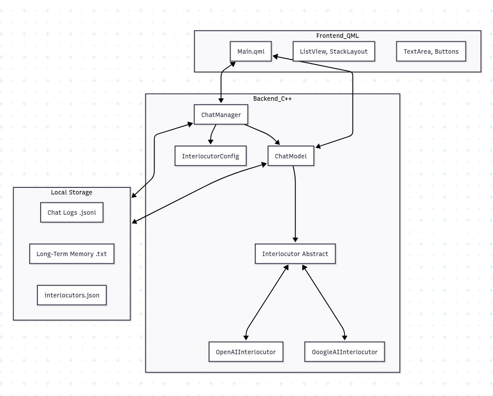
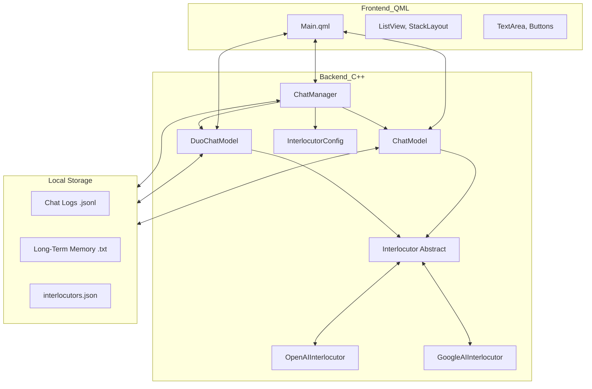

# Tether-Chat Software Design

## 1. Introduction

This document details the software architecture and design choices of **Tether-Chat**, an open-source local chat client designed for sustained, evolving conversations with Large Language Models (LLMs).

The primary design goal of Tether is to overcome the context window limitations of LLMs by implementing a **Rolling Context** mechanism that preserves long-term memory while maintaining immediate conversational relevance.

## 2. Architecture Overview

Tether-Chat is a desktop application built using the **Qt Framework** (version 6.x). It follows a classic Model-View-Controller (MVC) pattern, adapted for Qt's QML/C++ integration.

### High-Level Architecture

```mermaid
graph TD
    subgraph Frontend [Frontend_QML]
        UI[Main.qml]
        Views[ListView, StackLayout]
        Controls[TextArea, Buttons]
    end

    subgraph Backend [Backend_C++]
        CM[ChatManager]
        Model[ChatModel]
        Duo[DuoChatModel]
        Int[Interlocutor Abstract]
        OpenAI[OpenAIInterlocutor]
        Google[GoogleAIInterlocutor]
        Config[InterlocutorConfig]
    end

    subgraph Storage [Local Storage]
        JSONL[Chat Logs .jsonl]
        Mem[Long-Term Memory .txt]
        Conf[interlocutors.json]
    end

    UI <--> CM
    UI <--> Model
    UI <--> Duo
    CM --> Model
    CM --> Duo
    CM --> Config
    Model --> Int
    Duo --> Int
    Int <--> OpenAI
    Int <--> Google
    Model <--> Storage
    Duo <--> Storage
    CM <--> Storage
```

- **Frontend (View)**: Written in **QML** (Qt Quick). It handles the user interface, animations, and user input. It binds directly to C++ objects exposed as context properties.
- **Backend (Controller & Model)**: Written in **C++**. It handles the business logic, API communication, file I/O, and data management.
- **Bridge**: The `ChatManager` class serves as the main bridge between QML and C++.

## 3. Core Components

### 3.1. ChatManager
**Role**: Central Controller.

- Manages the application lifecycle and state.

- Maintains the list of configured `Interlocutor`s (AI personas).

- Handles the creation, deletion, and switching of active interlocutors.

- Exposes configuration options to the QML UI.

**Design Choice**: A singleton-like manager (though instantiated in `main.cpp`) simplifies the QML integration by providing a single entry point (`_chatManager`) for all global actions.

### 3.2. ChatModel
**Role**: Data Model & Logic Engine.

- Inherits from `QAbstractListModel` to provide data directly to the QML `ListView`.

- Stores the list of `ChatMessage` objects.

- **Crucial**: Implements the "Rolling Context" logic (curation and summarization).

- Manages file attachments (`ManagedFile`).

**Design Choice**: Coupling the message storage with the rolling context logic in `ChatModel` ensures that the UI always reflects the exact state of the conversation, including when messages are culled for summarization.

### 3.3. DuoChatModel (AI ↔ AI Conversations)
**Role**: Orchestrator of conversations between two AI interlocutors, with full identity continuity for each side.

- Inherits from `QAbstractListModel` to feed the dedicated "AI ↔ AI" tab.

- **Identity continuity**: each side keeps its OWN rolling context — the very same journal file (`<name>.jsonl`) and long-term memory file (`<name>_memory.txt`) used by its human-facing chat. Every duo message is appended to **both** sides' journals, each from its own perspective:
    - its own words are stored as `assistant` turns;
    - the partner's words are stored as `user` turns, prefixed with `[PartnerName]: ` so that the AI — and the later memory curation — can always tell the partner apart from the human user.

- Each side's API request is simply **its full journal**, so during the duo the AI also remembers its recent exchanges with the human verbatim; and once back in the human-facing chat, it remembers the duo conversation — verbatim while recent, curated into long-term memory when old. The human can therefore discuss the experience with the AI afterwards.

- **Per-side memory curation**: when a side's context exceeds its model's threshold (from `ModelRegistry`), the standard curation cycle runs for that side. The prompt-building, memory-file I/O and token estimation are shared with `ChatModel` through the stateless helper class **`MemoryCurator`** (no code duplication). As in `ChatModel`, the journal file is only rewritten on disk **after** a successful summary; on failure the culled messages are restored in memory, so no content is ever lost without a summary.

- The duo transcript (`duo_<A>__<B>.jsonl`, messages tagged with `ChatMessage::speaker`) remains the display/persistence backbone of the tab: it determines whose turn it is and survives restarts. Clearing it does **not** touch the sides' journals (that's their lived experience).

- Owns **dedicated `Interlocutor` instances**, created by `ChatManager::selectDuoPair()`. This guarantees that signals, pending network replies, and system prompts never interfere with the human-facing `ChatModel`. The `Interlocutor` subclasses are completely unchanged.

- The conversation opener is a **kick-off prompt** persisted in the initiator's journal only ("You're now in conversation with X… you may initiate the conversation with a first message."); the partner never sees it.

- A per-run **message budget** (`maxTurns`, persisted via QSettings) auto-pauses the exchange, keeping the user in control of token spending.

- **Solo/duo coordination**: while a duo run involves the interlocutor active in the main Chat tab, the solo send button is locked; when the duo session becomes idle, `ChatManager` reloads the solo `ChatModel` from disk (`reloadFromDisk()`) so the UI reflects the updated journal.

**Design Choice**: A separate model class (rather than extending `ChatModel`) keeps the human-facing logic single-perspective and untouched, while `MemoryCurator` factors the curation cycle they both share.

**Known limitations**: selecting the same interlocutor on both sides is rejected (both sides would read and write the same journal and memory files concurrently — create a second configuration of the same model under another name for self-dialogue); if the same persona is active in the solo chat and in a duo simultaneously, notebook writes follow a last-writer-wins rule.

### 3.4. Interlocutor (Abstract Base Class)
**Role**: AI Provider Abstraction.

- Defines the interface for communicating with different LLM providers (`sendRequest`, `uploadFile`).

- Concrete implementations: `OpenAIInterlocutor`, `GoogleAIInterlocutor`, `DummyInterlocutor`.

**Design Choice**: This polymorphism allows Tether to be easily extended to support new providers (e.g., Anthropic, Mistral, Local LLMs via Ollama) without modifying the core `ChatManager` or `ChatModel` logic.

### 3.5. InterlocutorConfig & ModelRegistry
**Role**: Configuration Management.

- `InterlocutorConfig`: Stores settings for a specific persona (Name, API Key, System Prompt, Model).

- `ModelRegistry`: Provides metadata about available models (context window size, pricing, capabilities).

## 4. Key Features & Design Choices

### 4.1. The Rolling Context (Memory Management)
This is Tether's defining feature. Standard chat clients send the entire available history until the context limit is hit, then simply drop the oldest messages. Tether takes a more sophisticated approach:

1.  **Active Journal (Live Memory)**: Recent messages are kept verbatim in the `ChatModel`.
2.  **Threshold Check**: When the token count of the Active Journal exceeds a defined trigger (e.g., 12k tokens), the **Curation** process begins.
3.  **Culling**: The oldest messages are removed from the Active Journal until the token count drops below the target (e.g., 10k tokens). The culling happens **in memory only** at this stage: the `.jsonl` journal file is not rewritten yet.
4.  **Summarization**:
    - The culled messages are combined with the *existing* Long-Term Memory.
    - The AI is asked to produce a **new** unified summary that integrates the old memory with the events of the culled messages.
    - This new summary replaces the old Long-Term Memory (after a timestamped backup of the previous version).
    - Only once the summary is saved successfully is the journal file rewritten without the culled messages. If the summarization fails (error, incomplete or empty answer, save failure), the culled messages are restored into the Active Journal so that no content is ever lost without a summary. `ChatModel` and `DuoChatModel` both follow this scheme.
5.  **Context Injection**: For every new request, the current Long-Term Memory is injected into the system prompt (or a dedicated memory block), ensuring the AI "remembers" the entire history, albeit in a compressed form.

**Why this way?**
- **Continuity**: The AI never "forgets" key facts, even after thousands of messages.
- **Efficiency**: We don't waste tokens re-sending irrelevant verbatim history.
- **Evolution**: The memory evolves and refines itself over time, mimicking human memory.

### 4.2. Persistence Strategy
- **Chats**: Stored as **JSON Lines (.jsonl)** files.
    - *Why?* JSONL is robust. New messages are simply appended to the file. If the app crashes, the file remains valid. It's also human-readable and easy to parse.
- **Memory**: Stored as plain text files (`_memory.txt`).
    - *Why?* The memory is a single block of text injected into the prompt. Storing it as raw text is the most direct representation.
- **Configuration**: Stored as a standard JSON file (`interlocutors.json`).

### 4.3. UI/UX Philosophy
- **QML**: Chosen for its ability to create fluid, modern, hardware-accelerated interfaces that look good on high-DPI displays.
- **Single-Threaded Focus**: The UI is designed around *one* active conversation at a time, reinforcing the "relationship" aspect of Tether rather than a "utility" aspect.

## 5. Extending Tether

### Adding a New Provider
To add a new AI provider (e.g., Anthropic):
1.  Create a new class `AnthropicInterlocutor` inheriting from `Interlocutor`.
2.  Implement `sendRequest` to handle the specific API signature.
3.  Update `ChatManager::createInterlocutorFromConfig` to instantiate the new class.
4.  Update `ModelRegistry` to include Anthropic models and their context limits.

### Future Improvements
- **Local LLM Support**: Integration with tools like Ollama or generic OpenAI-compatible endpoints.
- **Vector Database**: For even larger memory retrieval (RAG), replacing the linear summary with semantic search.
- **Multi-modal Support**: Extending `ChatMessage` to handle images and audio natively.
